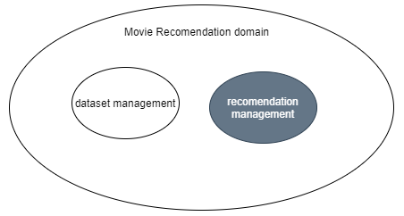

# Mobile Bootcamp: Devtest 02

All entertainment websites or online stores have millions/billions of items. It becomes challenging for the customer to select the right one. Under this scenario, recommender systems come into the picture and help the user to find the right item by minimizing the options.

## Simple Recommender 

The Simple Recommender module offers generalized recommendations to every user based on movie popularity and (sometimes) genre. The main idea for the system’s functionality is that movies that are more popular and more critically acclaimed will have a higher probability of being liked by the average audience. Notice, this model does not give personalized recommendations based on the user so that is out of the scope.

The implementation of this model should be basic. All we have to do is sort our movies based on ratings and popularity and display the top movies of our list. As an added step, we can pass in a genre argument to get the top movies of a particular genre.

We will use IMDB's weighted rating formula. Mathematically, it is represented as follows:

**Weighted Rating (WR)** =  (v/(v + m)  .R) + (m/(v + m)  .C)

Where:
	v is the number of votes of the movie
	m is the minimum votes required to be listed on the list.
	R is the average rating of the movie
	C is the mean vote across the whole report

The next step is to determine an appropriate value from the minimum votes required to be listed in the chart. We will use the 95th percentile as our cutoff. In other words, for a movie to feature in the charts, it must have more votes than at least 95% of the movies on the list.

## Functional Requirements

We want to build a tool that helps people to find movies according to popularity and genres from a big dataset, to do this we will need to build the web service with the following requirements:

- Recommendations module: Any user that has access to the Rest API URL can query the top list recommendation using movie genres.
- The service should be able to read a local dataset with thousands of movie records (CSV file).
- The time for getting recommendations is important, let’s find a way to process the data and cache the results for improving the time query.

## Proposed Design

